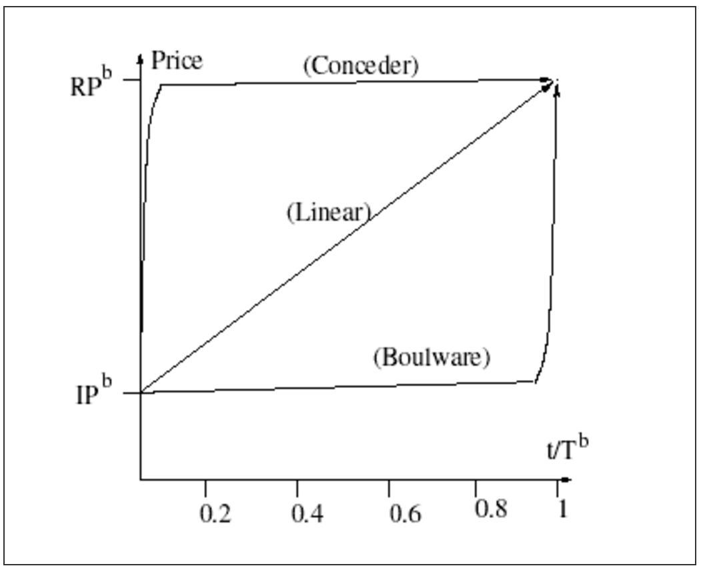
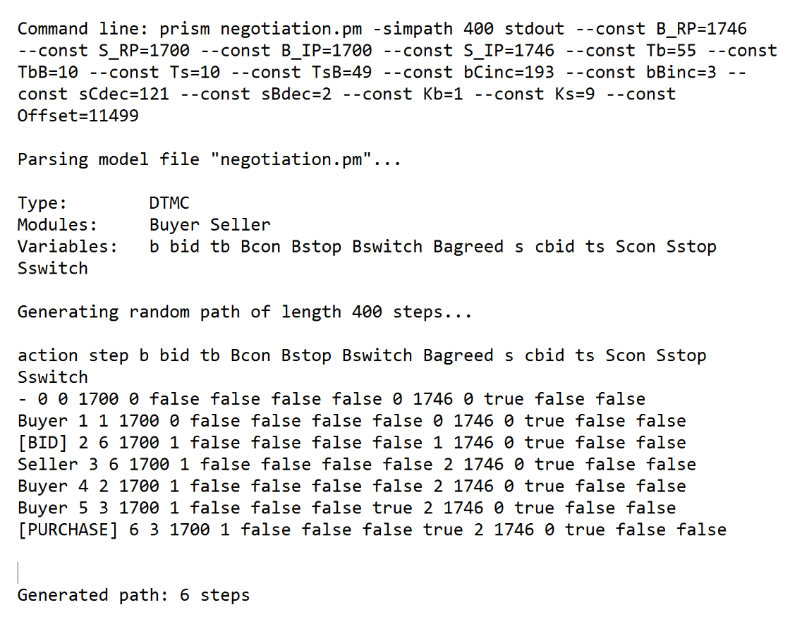
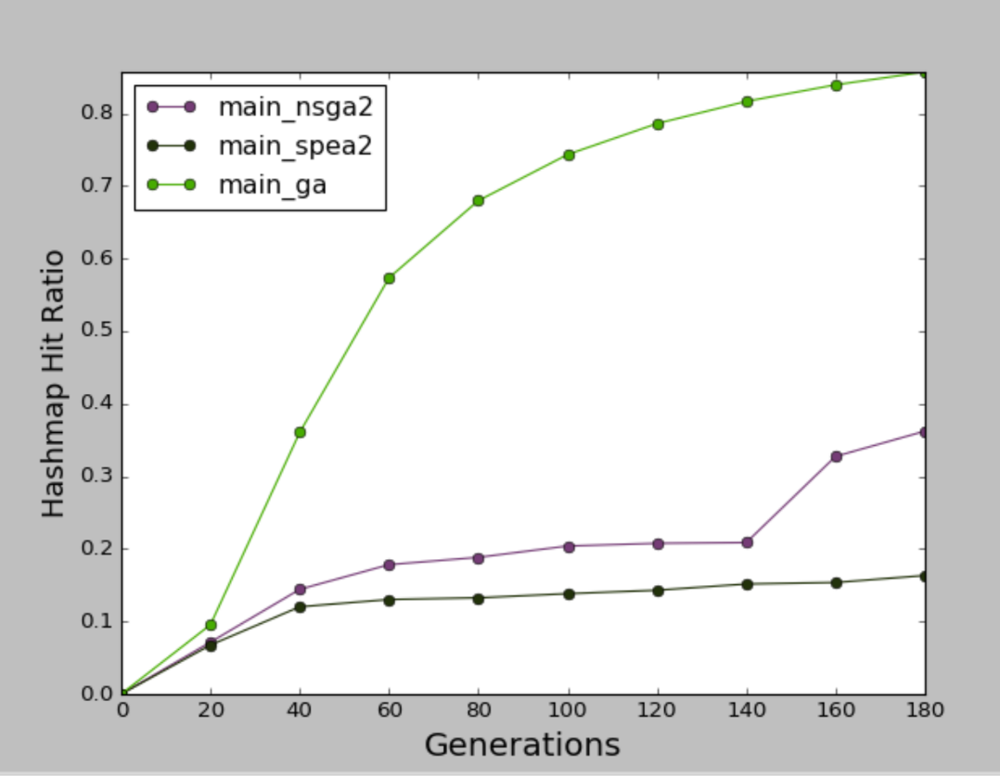
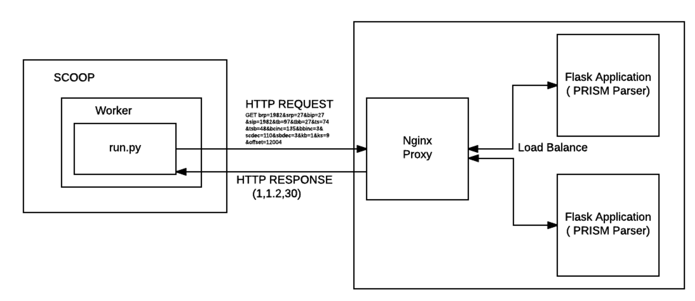
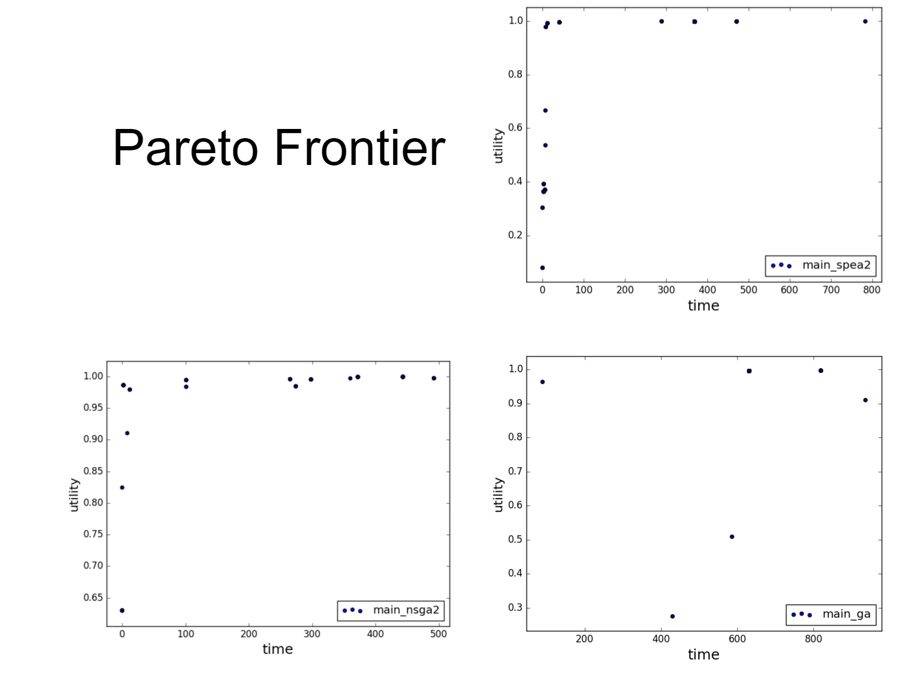
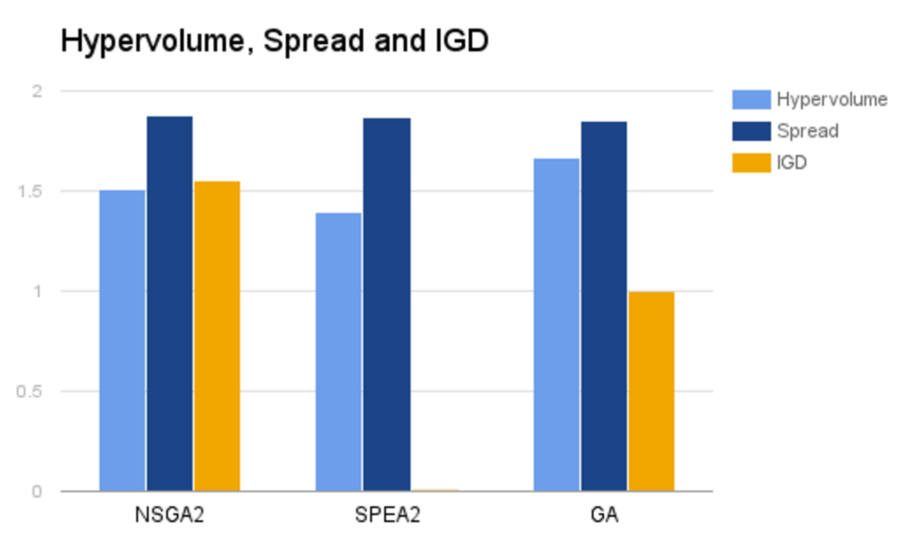
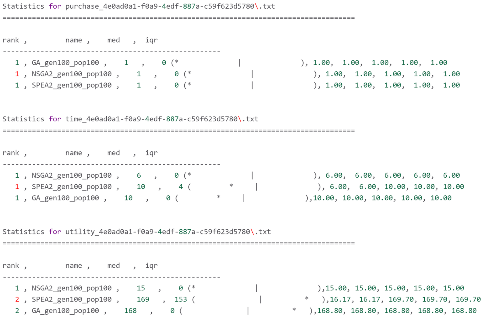

# Alternating Offers Protocol (Rubenstein)
##### Team Members
* Aniket Dhuri (adhuri@ncsu.edu)
* Ian Drosos (izdrosos@ncsu.edu)
* Karan Jadhav (kjadhav@ncsu.edu)

##### Date : December 07 , 2016  

### 1. Abstract  

Bargaining between buyers and sellers is an activity that has been around since the dawn of civilization. Both parties ideally want low and high prices and try to agree on a price somewhere in between. The large number of decisions that affect the bargaining and the non-deterministic nature of this process’s model, make finding the best solutions difficult and model simulation a slow process. This project made use of prism model simulator to simulate the model and used three different genetic algorithms namely GA,NSGA2 and SPEA2  to find the best decision sets for the buyer-seller model. It also used parallelism and early termination to improve the overall run time of running optimizers on the model.

### 2. Keywords
1. **Prism** : PRISM is a probabilistic model checker, a tool for formal modelling and analysis of systems that exhibit random or probabilistic behaviour.
2. **GA** : Genetic Algorithm is a method for solving both constrained and unconstrained optimization problems based on a natural selection process that mimics biological evolution.
3. **NSGA2** : Non-dominated sorting genetic algorithm for multi objective optimization that makes use of multiple frontiers and primary/secondary sorting.
4. **SPEA2** : Strength pareto evolutionary algorithm for multi objective optimization that uses dominance count and an archive,which is a set of good solutions.
5. **Spread** : How distant each point of a population is from its neighbours
6. **IGD** : Distance between the ideal and obtained pareto front.
7. **Hypervolume** : The volume inside the pareto frontiers.
8. **DEAP** : Distributed Evolutionary Algorithms in Python (DEAP) is a novel evolutionary computation framework for rapid prototyping and testing of ideas.
9. **SCOOP** : Scalable COncurrent Operations in Python (SCOOP) is a distributed task module allowing concurrent parallel programming on various environments, from heterogeneous grids to supercomputers. 

### 3. Introduction
The buyer-seller model depends on many decisions such as buyer/seller initial price, reserved price, strategy, time deadline, etc. The utility value depends on the value at which the buyer and seller agreed for purchase as well as on the time when the agreement was made.The utility value would be higher for purchase value made earlier. The prism model we used had 15 decisions and generated 3 objectives. The large number of decisions in this model was a major challenge undertaken in this project as it becomes increasingly difficult to explore the large solution space. In addition to this, the model simulation took several hours to complete due to the simulation overhead caused by prism simulation. This led us to pursue a new objective to improve the run time by using parallelism, load balancing and early termination.

### 4. Background
#### 	1. Rubinstein’s Bargaining Model
The bargaining model[1] features alternating offers through an infinite time horizon where two individuals have several possible contractual agreements before them. The standard model has following elements-

1. Two players - Buyer and Seller.
2. Unlimited offers to reach consensus until one player accepts an offer
3. Alternating offers - first player makes an offer and if second player rejects, the game moves to the next period where second player makes an offer, and so on.
4. Delays are costly since utility value decreases as time progresses.

#### 	2. Prism Model
The model used in this project is based on the Rubinstein’s Alternating Offers protocol negotiation framework. The model used was already implemented as a Discrete Time Markov Chain model in the PRISM language, a simple state based language to be run on prism model checker tool.

1. In this, both buyer and seller bargain over an item, proposing offers or counter offers until number of steps configured.
2. Disagreement is the worst outcome and players prefer any agreement at least as much as disagreement.
3. Players seek to maximize utility. For two outcomes of the same value, the one with lesser time has higher utility.

#### 	3. Model states


The model can have the following states as seen in the figure above:

1. Wait Bid : Seller awaiting a bid
2. Bid : Buyer proposing a bid
3. Purchase : Either seller or buyer agreeing to the proposed value
4. Bid Result : Seller’s response on buyer’s bid
5. Wait CBid : Buyer awaiting seller’s counter offer after bid rejection
6. CBid : Counter bid thrown by seller after rejection of buyer’s bid
7. CBid Result : Buyer’s response on seller’s counter bid


The buyer makes a bid and if the seller agrees, purchase is completed. Otherwise, he waits for a counter bid (cbid). If counter bid is rejected , the buyer bids again.
The seller waits for a bid and if accepted, the purchase is done. Otherwise he makes a counter bid and the process continues till either the seller or buyer agrees to a bid or cbid. 

#### 	4. Strategy
The buyer and seller follow two strategies - Conceder (if the player is willing to yield a lot in the early phase of negotiation) and Boulder (if a player is willing to concede considerably only when it's time deadline is approaching).


In the above diagram , we can see the Buyer strategies for both linear and nonlinear . RP - Reserved Price and IP - Initial Price.

#### 	5. Decisions
| No 	| Decision                          	| Description                                                                                                 	| Range we used      	|
|----	|-----------------------------------	|-------------------------------------------------------------------------------------------------------------	|--------------------	|
| 1  	| Buyer Initial price B_IP          	| Ideal high and low price at which,buyer begin                                                               	| Buyer(1,100)       	|
| 2  	| Seller Initial price S_IP         	| Ideal high and low price at which seller begin                                                              	| Seller (1000,2000) 	|
| 3  	| Buyer reserved PriceB_RP          	| Threshold where a player rejects offer 100% of the time                                                     	| Buyer(1000,2000)   	|
| 4  	| Seller reserved PriceS_RP         	| Threshold where a player rejects offer 100% of the time                                                     	| Seller(1,100)      	|
| 5  	| Buyer Time-deadlineTb             	| Time that player will quit negotiation if no agreement                                                      	| Buyer(50,100)      	|
| 6  	| Seller Time-deadlineTs            	| Time that player will quit negotiation if no agreement                                                      	| Seller(50,100)     	|
| 7  	| Boulware Strategy Switch Time TbB 	| When a player begins to start conceding from a boulware strategy                                            	| (20,40)            	|
| 8  	| Conceder Strategy Switch Time TsB 	| When a player stops conceding based on the offered value based on reserved price.                           	| (48, 49)           	|
| 9  	| Buyer conceder incrementbCinc     	| Increment in buyer’s bid for Conceder strategy                                                              	| (100,200)          	|
| 10 	| Buyer Boulware incrementbBinc     	| Increment in buyer’s bid for Boulware strategy                                                              	| (1,3)              	|
| 11 	| Seller conceder decrementsCdec    	| Decrement in seller’s bid for conceder strategy                                                             	| (100,200)          	|
| 12 	| Seller Boulware decrementsBdec    	| Decrement in seller’s bid for Boulware strategy                                                             	| (1,3)              	|
| 13 	| Buyer’s switching factor Kb       	| Buyer stops conceding when it’s next bid is lesser thanBuyer switching factor * Buyer conceder increment    	| (1,2)              	|
| 14 	| Seller’s switching factor Ks      	| Seller stops conceding when it’s next bid is lesser thanseller switching factor * seller conceder increment 	| (8,9)              	|
| 15 	| Offset                            	| Allows for considering a shifted accepting interval while minimizing model complexity                       	| (10000, 15000)     	|

#### 	6. Decision constraints
The following were the constraints for the decisions that we checked using the ok() function in our code:

1. Buyer Initial Price < Buyer Reserved Price
2. Seller Reserved Price < Seller Initial Price
3. Buyer/Seller Time deadline > 0
4. Buyer’s start conceding time deadline < Buyer time deadline
5. Seller’s stop conceding time deadline < Seller time deadline

#### 	7. Objectives 

| No 	| Objective 	| Description                                                                                                                                                                    	| Min/Max  	|
|----	|-----------	|--------------------------------------------------------------------------------------------------------------------------------------------------------------------------------	|----------	|
| 1  	| Utility   	| The purchase value agreed upon, dependent on time. Among two purchase outcomes having the same value, the one with lesser time has higher utilityUtility = Purchase value/time 	| Maximize 	|
| 2  	| Time      	| Time taken to come to a purchase agreement                                                                                                                                     	| Minimize 	|
| 3  	| Purchase  	| If purchase was successful Purchase =1 else Purchase =0.                                                                                                                       	| Maximize 	|

### 5. Related Work

In the paper[2] Automated Game Analysis via Probabilistic model Checking , the authors did a case study to show how a probabilistic model checking tool can be used for automated analysis in a uncertain environment and agent. The paper did an analysis of two scenarios  claiming  in linear strategies - slow is better than faster and in non-linear strategies - the shorter conceding time is better.
Authors covered limited scenarios since the simulation was done manually using prism model checking tool.

We on the other hand used genetic algorithms to cover more scenarios.

### 6. Implementation 
#### 	1. Prism parser 
Prism model checker has a CLI program which takes the model file as an input along with max steps ( simpath) and the 15 decisions we discussed in the previous sections.  The CLI simulates each step and displays if a purchase was made. We use the following algorithm to parse the simulation and extract the objectives.
```
if ( last step contains “[PURCHASE]” ) :
	“””Purchase was successful “””
	purchase = 1  # 1 is successful purchase
	time = step
	if ( previous == “[BID]” ) : 
		value = BID
	else ( previous == “[CBID]” ) :
		value = CBID
	utility = value / time .
else : 
	“”” Purchase was unsuccessful”””
	purchase = 0 # 0 is unsuccessful purchase
	time = MAXINT
utility = -1 
```
Following figure shows the example simulation.



In the above example , time = 6 and purchase = 1 . Since last bidding was [BID] , value = 1700 ( bid value ) . utility = 1700/6 = 283.3.

#### 	2. DEAP


Distributed Evolutionary Algorithms in Python (DEAP) is a evolutionary computation framework for rapid prototyping and testing of ideas and seeks to make algorithms explicit and data structures transparent. It was this transparency and generalized framework that attracted us to use DEAP for development. DEAP has selection,mutation and crossover operators [3] already developed that helped faster development .DEAP has a learning curve which made us read the documentation and test some simulations without prism parser before we proceeded with integration.

#### 	3. Optimizers

OPTIMIZERS
We declare the common functions for population generation, mate and mutate first.
The population was generated as follows:
```creator.create("Fitness", base.Fitness, weights=(4.0, 1.0, -1.0),crowding_dist=None) ```

Here the weights for ( purchase, utility , time ) are (4.0 , 1.0 and -1.0 ) . Here, negative values show minimizing objective. Positive values show maximizing objective. A 4.0 shows that weightage of purchase is higher than the other objectives , so that we get more purchases in the final population.

We define the mate and mutate functions for NSGA2 and SPEA2 for each decision for range ( BOUND_LOW, BOUND_UP ) as:
```
toolbox.register("mate", tools.cxSimulatedBinaryBounded, low=BOUND_LOW, up=BOUND_UP, eta=1.0)
toolbox.register("mutate", tools.mutPolynomialBounded, low=BOUND_LOW, up=BOUND_UP, eta=1.0, indpb=1.0/NDIM)
```
##### NSGA2

1. We first defined the select function :
```toolbox.register("select", tools.selNSGA2)```
2. Generate a population using DEAP
```pop = toolbox.population(n=MU)```
3. Evaluate individuals with invalid fitnesses and evaluate fitnesses again for them
```invalid_ind = [ind for ind in pop if not ind.fitness.valid]
    fitnesses = toolbox.map(toolbox.evaluate, invalid_ind)
    for ind, fit in zip(invalid_ind, fitnesses):
       ind.fitness.values = fit```
4. Assign crowding distance to the population
```pop = toolbox.select(pop, len(pop))```
5. For every generation run
	* Create new population “offspring” by cloning the population
```offspring = tools.selTournamentDCD(pop, len(pop))
offspring = [toolbox.clone(ind) for ind in offspring]```
	* Using alternate pairs of the new population, with crossover probability mate the two selected individuals and then mutate them
```for ind1, ind2 in zip(offspring[::2], offspring[1::2]):
            if random.random() <= CXPB:
                toolbox.mate(ind1, ind2)
toolbox.mutate(ind1)
toolbox.mutate(ind2)```
	* Evaluate fitness for all invalid individuals again
	* Select the best individuals from the old and new population
```pop = toolbox.select(pop + offspring, MU)```
	* Run steps A-D for the next generation

*Params for NSGA2*

CXPB : Crossover probability : 0.9

MUT  : Mutation probability : 0.03

NDIM :  30


##### SPEA2
We define the select function as:
```toolbox.register("select", tools.selSPEA2)```
The steps, code and params are the same as NSGA2


*Params for SPEA2*

CXPB : Crossover probability : 0.9

MUT  : Mutation probability : 0.03


##### Genetic Algorithm

The mate and mutate and select functions are defined:
```toolbox.register("mate", tools.cxTwoPoint)
toolbox.register("mutate", tools.mutUniformInt, low = BOUND_LOW, up = BOUND_UP, indpb=MUTPB)
toolbox.register("select", tools.selTournament, tournsize=3)```


GA follows the same steps as NSGA 2 except for the following differences:
* The crossover individuals are mutated based on a mutation probability
```if random.random() < MUTPB:
   toolbox.mutate(mutant)
* The next generation population is not composed of the best individuals from the old and new population but rather entirely of the new population
pop[:] = offspring```


*Params in GA*

CXPB : Crossover probability : 1.0

MUT  : Mutation probability : 0.01

#### 	4. SCOOP

SCOOP (Scalable COncurrent Operations in Python) is a distributed task module allowing concurrent parallel programming on various environments, from heterogeneous grids to supercomputers.DEAP works in perfect harmony with parallelisation mechanism such as multiprocessing and SCOOP. We tried with multiprocessing which helped us improve run time but faced issues due to due to limitation of processors on laptop hardware and VCL Virtual machines.
SCOOP let us configure number of parallel workers by ```python -m scoop -n 100 run.py  # n = number of workers``` .

#### 	5. Optimizations to run time

Without optimization , the prism parse call takes 2.5 seconds on an average. So for 100 Generations and 100 Populations we will have 100*100 evaluations taking 100*100*2.5 ~ 7 hours to run the simulation. NSGA2 without prism parse call takes on average 5 minutes. So we went with optimization of the run time for prism simulation.

#####	1. Caching

Initially , we used python dictionaries for caching , and due to synchronization issues on multi processing and scoop we went with a single cache using Redis. Redis server has cache expiry timer in case we want to invalidate cache entries and we have implemented this in our code.



We have seen GA had around 70% of cache hit for 100 generations. That would reduce number of evaluations to (1 - 0.7 ) *100 *100 * 2.5 ~ 2 hours. For NSGA2 and SPEA2 we have seen around 30% hit ratio due to the configured mutation and crossover values. But caching has improved overall runtimes for simulation.  

#####	2. SCOOP

SCOOP helped us configure number of workers, so when workers (n) = 100 , 100 evaluations are done at a time. But the prism CLI couldn’t handle 100 requests simultaneously and failed for more than 4-5 workers. We could have added a queue to handle those requests but that would not help improve the runtime. So we went ahead with having multiple machines each running prism CLI.  

#####	3.Nginx and uwsgi

To integrate those multiple machines to handle the requests from 100 SCOOP workers we chose HTTP protocol and developed a flask application that used uwsgi to create sockets. The requests were load balanced on these sockets using an NGINX web proxy server. The architecture is as follows - 



SCOOP workers run the run.py and they send the evaluation requests over HTTP to Nginx proxy which distributes the works across 10 VCL machines running Prism Parser. The response is sent back. We have seen 100*100 evaluations taking less than 15 minutes which initially took 7 hours.  

#####	4.Early termination

We calculated standard deviation , min , max and average values for each generation. For two subsequent generations, if all of these values are same , we do an early termination. For NSGA2 and SPEA2 we have seen early termination of 25- 45 generations and for GA around 35- 60 Generations.  

### 7. Results

#####	1.Run times

With the above optimizations we ran the 3 algorithms and following were the run times observed.

| Optimizer 	| Run Time (secs) 	| Run Time (mins) 	| Early Termination 	|
|-----------	|-----------------	|-----------------	|-------------------	|
| NSGA2     	| 421.781         	| 7.03            	| Generation 26     	|
| SPEA2     	| 409.983         	| 6.83            	| Generation 25     	|
| GA        	| 3341.352        	| 55.6            	| Generation 37     	|


NSGA2 and SPEA2 showed significant improvement for evaluation. SCOOP provides map reduce for selection and SPEA2 and NSGA2 better utilizes this. The GA code we wrote used Tournament selection for two children, and mutation and cross over over the children to generate new children in the population. This did not use the SCOOP feature of map reduce.

#####	2. Pareto Frontier



When we plot the pareto for time vs utility for all purchase = 1 , we see NSGA2 and SPEA2 showed points reaching the utopia point ( time = 0 and utility = infinity ).
GA needed fine tuning to get better points, but we faced issues with over tuning where after several generations , a single point would dominate the other points.


#####	3.Hypervolume, Spread and IGD

We used Hypervolume, spread and Inter Generational distance to compare the optimizers we used. Hypervolume is volume inside the pareto frontiers , more the better.  We calculated reference set by aggregating the pareto frontier from the 3 algorithms and taking the best 100 population. Spread and IGD uses this reference set to compare. Spread calculates how distant each point of a population is from its neighbours. The more the spread is, the better spread out the population. IGD is distance between reference set and obtained pareto frontier. Lesser the IGD, the better it is, since more population is in the best set.




In the above graph, NSGA2 had better spread and SPEA2 had better IGD. Infact, SPEA2 had most of the best solutions in the reference set. NSGA2 did give better looking pareto front but did not have the best points selected. This could be due to DTMC behavior of prism calls where same decision set would give varied objectives every run. We cleared the cache after every algorithm so that it does not affect the speeds of the second and third algorithm.
GA had better hypervolume. This may be due to the extraneous points which did not show better curve. As far as spread goes, NSGA2 and SPEA2 had almost similar values , but NSGA2 had better value.


#####	4. Stats.py 

Stats.py was used from Dr. Menzies’s repository to compare the algorithms ,based on each objective. For purchase , all algorithms had median 1 which showed purchases were made and all were in the same rank. For time ,  NSGA2 had a better median , but all algorithms were in the same rank. For utility , SPEA2 showed higher values and GA had similar values and were ranked in same category.




**Run time issues**
Some algorithms may not show significant improvement due to SCOOP if they do not use map feature for evaluation. We have seen this behaviour for GA we implemented.


### 8. Conclusion 

We used DEAP framework which can help implement new algorithms quickly. SCOOP compatibility with DEAP and other optimization strategies helped improve runtimes by 99x for NSGA2, 99x for SPEA2 and 86x for GA. NSGA2 and SPEA2 gave good points. Most of the best points from all three algorithms were from SPEA2. GA needs better tuning. Also, since we could scale the prism calculations, evaluations were done faster which helped us cover more area . Also , we performed specific scenarios by varying the range for each decision which helped us verify and make claims for the model. The optimizers chose final populations that had the seller choose boulware strategy quicker in the best interest of the seller which is based on the original authors’ claim.The optimizers chose boulware increments that were higher for the seller and time is an important factor, so even though it wanted to be boulware it had to still get an agreement.  The larger the boulware increment, the faster they approach an agreement between buyer and seller. 

### 9. Future Work

We created prism parser for our model and sent the objectives over, but we can use cgi-bin for sending the raw results for each model simulation. This along with a load balancer would help run the simulation in parallel. Along with this ,we have configured bounds for each decisions. Varying the bounds in a specific interval can help us generate pareto frontiers for specific scenarios. In terms of objectives , we have seen only 3 objectives, but adding more objectives like utility value for seller or buyer separately and finding solutions better for buyer or seller  perspective can be helpful. We can also associate a property like is_item_perishable to make sure that items sold after their perish date will have 0 utility. As of now, we have used standard NSGA2 and can replace the BDOM function with CDOM to get better elite solutions. We tried going ahead with Differential Evolution but couldn’t tune it better to get good results. Using Particle swarm optimization to tune DE might help us get better and faster pareto frontier.


### Reference 

[1] Prism Model Alternating Offers Protocol - http://www.prismmodelchecker.org/casestudies/negotiation.php

[2] “ P. Ballarini, M. Fisher, M.J. Wooldridge” ,  Automated Game Analysis via Probabilistic Model Checking.

[3] - DEAP operators . http://deap.readthedocs.io/en/master/api/tools.html#operators

